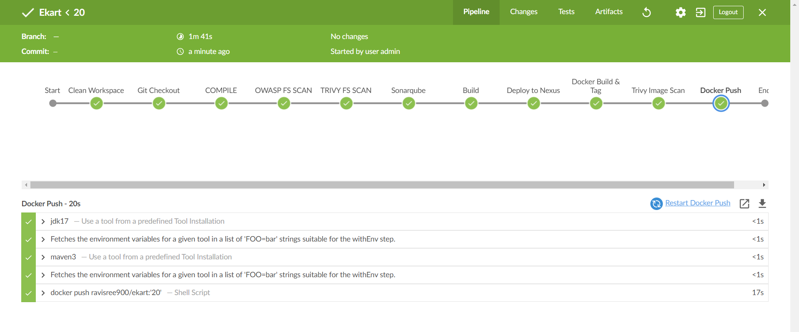

# Deploying the Ekart application

Steps for the Project:

1) Launch an EC2 instance with t2.large
2) Install require softwares like Java11, Jenkins, and Docker
3) Run docker containers for SonarQube and Nexus
4) Dependency check using OWASP
5) Deploy into docker containers

======================================================================================

Java Commands:
--------------
    sudo apt update

    sudo apt-get install -y openjdk-11-jdk

    java --version

Jenkins Installation Commands:
------------------------------

    sudo wget -O /usr/share/keyrings/jenkins-keyring.asc \
    https://pkg.jenkins.io/debian-stable/jenkins.io-2023.key

    echo deb [signed-by=/usr/share/keyrings/jenkins-keyring.asc] \
    https://pkg.jenkins.io/debian-stable binary/ | sudo tee \
    /etc/apt/sources.list.d/jenkins.list > /dev/null

    sudo apt-get update

    sudo apt-get install jenkins -y

    sudo systemctl enable jenkins

    sudo systemctl start jenkins

    sudo systemctl status jenkins

    jenkins  --version

Docker Installation Commands
-----------------------------

    sudo apt-get install docker.io -y

    docker --version

to add docker into the user

    sudo usermod -aG docker $user

    newgrp docker

    sudo chmod 777 /var/run/docker.sock

Run Docker containers for Sonar and Nexus
-----------------------------------------

    docker run -d --name sonar -p 9000:9000 sonarqube:lts-community

    docker run -d --name nexus -p 8081:8081 sonatype/nexus3

Install Required Plugins 
------------------------
    1) Eclipse temurin Plugin
    
    2) Sonar Scanner Plugin

    3)Pipeline maven integration Plugin

    4) Docker,  Docker Pipeline, Docker-Build-step, plugins

    5) OWASP dependency plugin 

    6) config file provider

go to manage Jenkins ==> click on tools ==> 
-------------------------------------------

in Jkd Section:

    giva name as "jdk17" ==> select install automatically ==> click on install from adoptium .net ==> select java version as jdk-17.0.8

in sonarqube section: 

    Give name as "sonar-scanner" 

in maven section:

    give name as "maven3" ==> select version as "3.6.3"

in dependency section: 

    give name as "DC" ==> select install automatically ==> select install from github.com ==> version as "6.5.1".

in docker section: 

    give name as "docker" ==> select install automatically ==> select install from docker.com ==> select latest 

apply and save.

Login into SonarQube Server:
----------------------------
    username: admin
    password: admin

    after login ==> click on Administration ==> click on security ==> click on users ==> click on token below lines ==> Generate a token here

Goto manage jenkins ==> Credentials :
------------------------------------

    ==>  click on global ==> click on Add credentials ==> select "secret text" ==> in secret text <paste the token> ==> ID as "sonar" ==> description as "sonar" .

Goto manage jenkins ==> systems:
--------------------------------

    ==> go to sonarqube server ==> click on add sonarqube ==> name as "sonar" ==> provide URL as <http://ip of sonar:9000> ==> select the   credentials here ==> apply and save.

Goto Dashboard: 
--------------

    Click on New Project --> Name as "Ekart" --> select pipeline and ok

goto pipeline section and the code is 

    pipeline {
        agent any
        tools{
            jdk  'jdk17'
            maven  'maven3'
        }

        environment {
            SCANNER_HOME=tool 'sonar-scanner'
        }
    
        stages {

            stage('Clean Workspace') {
                steps {
                    cleanWs()
                }
            }

            stage('Git Checkout') {
                steps {
                    git 'https://github.com/Ravindra0849/Ekart.git'
                }
            }
        }
    }

Build the application, the code is
----------------------------------

first compile the code:

    stage('COMPILE') {
            steps {
                sh "mvn clean compile -DskipTests=true"
            }
        }

for the OWASP dependency Check:

    stage('OWASP FS SCAN') {
            steps {
                dependencyCheck additionalArguments: '--scan ./ --disableYarnAudit --disableNodeAudit', odcInstallation: 'DC'
                dependencyCheckPublisher pattern: '**/dependency-check-report.xml'
            }
        }

Install Trivy for File scan 
---------------------------
    sudo apt-get install wget apt-transport-https gnupg lsb-release -y

    wget -qO - https://aquasecurity.github.io/trivy-repo/deb/public.key | gpg --dearmor | sudo tee /usr/share/keyrings/trivy.gpg > /dev/null

    echo "deb [signed-by=/usr/share/keyrings/trivy.gpg] https://aquasecurity.github.io/trivy-repo/deb $(lsb_release -sc) main" | sudo tee -a /etc/apt/sources.list.d/trivy.list

    sudo apt-get update
    
    sudo apt-get install trivy -y

    stage('TRIVY FS SCAN') {
            steps {
                sh "trivy fs . > trivyfs.txt"
            }
        }

For SonarQube Scanner:

        stage('Sonarqube') {
                steps {
                    withSonarQubeEnv('sonar'){
                    sh ''' $SCANNER_HOME/bin/sonar-scanner -Dsonar.projectName=Ekart \
                    -Dsonar.java.binaries=. \
                    -Dsonar.projectKey=Ekart '''
                }
                }
            }

To build the application:

    stage('Build') {
            steps {
                sh "mvn clean package -DskipTests=true"
            }
        }

To move artifact into Nexus Repo
--------------------------------

    ==> Login to Nexus account:
        username: admin
        password: stored in the location /nexus-data/admin.password

==> Go to docker containers and execute the commands for password
    docker exec nexus cat /nexus-data/admin.password

    it shows the password but carefully copy the password only

==> goto pom.xml file in your repo of this project and edit pom.xml file and go end of pom.xml file and add this content

    

for maven-release url ==> in nexus copy maven-release url and paste it maven-release url in pom.xml file 

for maven snapshots url ==> in nexus copy maven-snapshot url and paste it maven-snapshot url in pom.xml file 

and commit changes in github account after this changes.

Goto Jenkins Dashboard:
-----------------------
    ==> Go to manage Jenkins ==> click on managed files ==> click on add a new config ==> select global maven settings.xml ==> ID as "global-settings" ==> click on next.

    Go to below server credential content ==> we need to put our credentials ==> In this content go to servers ==> uncomment the credentials ==> provide your username and password of Nexus repo.

The step to deploy the artifact into Nexus is:

    Go to pipeline syntax and search for withMaven ==> Go to Global maven settings config ==> select MyGlobalSettings ==> and Generate the syntax.
    ==> In syntax Remove Jdk maven and maven settings config 

    stage('Deploy to Nexus') {
            steps {
                withMaven(globalMavenSettingsConfig: 'global-settings-xml') {
                    sh "mvn deploy -DskipTests=true"
                }
            }
        }

==> After the build is Successful and refresh the Nexus Repo ==> Click on Browser server content 

and left side click on Browser ==> 

==> Click on Maven-snapshots ==> we find the snapshots here

Goto DockerHub: 
---------------

    ==> Click on Your profile ==> click on account settings ==> click on security ==> generate a token here.

Goto manage jenkins ==> Credentials :
------------------------------------

    ==>  click on global ==> click on Add credentials ==> select "username and password" ==> in username as "docker username" ==> in password <paste the token> ==> ID as "Dockerhub" ==> description as "Dockerhub" .

To Build and Tag the docker image

    stage("Docker Build & Tag"){
            steps{
                script{
                   withDockerRegistry(credentialsId: 'Dockerhub', toolName: 'docker'){   
                       sh "docker build -t -f docker/Dockerfile ekart ."
                       sh "docker tag ekart ravisree900/ekart:'${env.BUILD_NUMBER}'"
                    }
                }
            }
        }

    stage("Trivy Image Scan"){
            steps{
                sh "trivy image ravisree900/ekart:'${env.BUILD_NUMBER}' > trivyimage.txt" 
            }
        }
        

To push into Docker Hub: 

    stage("Docker Push"){
            steps{
                script{
                   withDockerRegistry(credentialsId: 'Dockerhub', toolName: 'docker'){   
                       sh "docker push ravisree900/ekart:'${env.BUILD_NUMBER}'"
                    }
                }
            }
        }

To Deploy into Docker Container:

     stage("Deploy to Container"){
            steps{
                script{
                   withDockerRegistry(credentialsId: 'Dockerhub', toolName: 'docker'){   
                       sh "docker run -d --name ekart -p 8070:8070 ravisree900/ekart:'${env.BUILD_NUMBER}'"
                    }
                }
            }
        }

    username: admin
    password: admin

The application is Working Successfully.